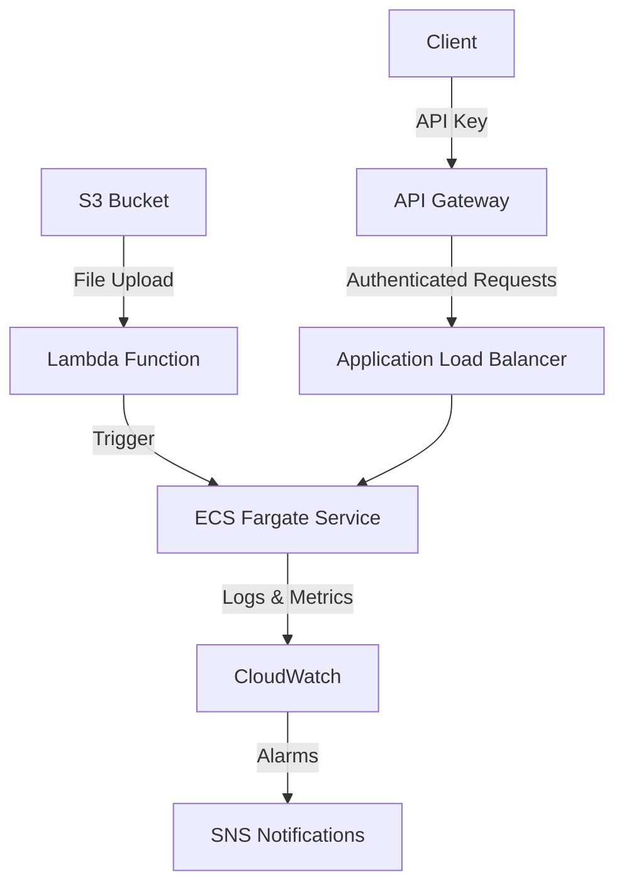

# MCP S3 Integration PoC

This project demonstrates the Model Context Protocol (MCP) to enable an AI model (via Amazon Bedrock) to fetch and summarize text files from an S3 bucket using a standardized MCP server. The solution is built on AWS using a serverless architecture with robust monitoring and security features.

## 🏗️ Architecture



The architecture consists of the following components:

1. **S3 Bucket**: Secure storage for text files with server-side encryption
2. **Lambda Function**: Processes new file uploads and triggers ECS tasks
3. **ECS Fargate Service**: Hosts the MCP server with auto-scaling capabilities
4. **API Gateway**: Provides secure, rate-limited HTTP endpoints with API key authentication
5. **CloudWatch**: Comprehensive logging, metrics, and alerting
6. **SNS**: Notification service for operational alerts
7. **Application Load Balancer**: Distributes traffic to ECS tasks

## 🚀 Prerequisites

- AWS Account with appropriate IAM permissions
- Terraform v1.2.0 or later
- AWS CLI v2.x configured with credentials
- Docker 20.10+ (for building the MCP server container)
- Git (for version control and CI/CD)
- jq (for processing JSON output)

## 🛠️ Setup Instructions

### 1. Clone the Repository
```bash
git clone <repository-url>
cd mcp-s3-poc
```

### 2. Configure Environment Variables
Copy the example environment file and update the values:
```bash
cp .env.example .env
# Edit .env with your configuration
```

### 3. Build and Push Docker Image
```bash
# Build the MCP server Docker image
./scripts/build_and_push.sh
```

### 4. Initialize Terraform
```bash
terraform init
```

### 5. Review and Apply Configuration
```bash
# Review changes
terraform plan -out=tfplan

# Apply configuration
terraform apply "tfplan"
```

### 6. Configure Email Notifications
After applying the Terraform configuration, check your email for an SNS subscription confirmation and confirm it to receive alerts.

### 7. Test the API
```bash
# Get API Gateway endpoint and API key from Terraform outputs
API_ENDPOINT=$(terraform output -raw api_gateway_endpoint)
API_KEY=$(terraform output -raw api_key)

# Test health check
curl -H "x-api-key: $API_KEY" $API_ENDPOINT/health

# Test file summarization
curl -X POST \
  -H "Content-Type: application/json" \
  -H "x-api-key: $API_KEY" \
  -d '{"file_key": "test_file.txt"}' \
  $API_ENDPOINT/summarize
```

## Troubleshooting

If you encounter issues after deployment, here are some common problems and their solutions:

### 1. 504 Gateway Timeout When Accessing MCP Server

**Symptom**: The MCP server returns a 504 Gateway Timeout error when accessed via the ALB.

**Solution**:
1. Check that the ECS task's security group allows inbound traffic from the ALB's security group on port 8080:
   ```bash
   aws ec2 authorize-security-group-ingress \
       --group-id <ecs-task-sg> \
       --protocol tcp \
       --port 8080 \
       --source-group <alb-sg> \
       --region eu-west-1 \
       --profile your-profile
   ```

### 2. Target Group Health Check Failures

**Symptom**: Target group health checks are failing with "Request timed out" errors.

**Solution**:
1. Verify the health check configuration:
   ```bash
   aws elbv2 describe-target-groups --names mcp-dev-tg --region eu-west-1 --profile your-profile
   ```
2. Ensure the MCP server's `/health` endpoint is accessible from the ALB
3. Check that security group rules allow traffic between the ALB and ECS tasks

### 3. ECS Task Not Starting

**Symptom**: ECS tasks are stuck in PENDING or fail to start.

**Solution**:
1. Check ECS service events for errors:
   ```bash
   aws ecs describe-services --cluster <cluster-name> --services <service-name> --region eu-west-1 --profile your-profile
   ```
2. Verify the ECS task execution role has permissions to pull from ECR
3. Check that the container image exists in ECR and is accessible

### 4. Lambda Not Triggering on S3 Upload

**Symptom**: Uploading files to S3 doesn't trigger the Lambda function.

**Solution**:
1. Verify the S3 bucket notification configuration:
   ```bash
   aws s3api get-bucket-notification-configuration --bucket <bucket-name> --profile your-profile
   ```
2. Check Lambda function permissions to ensure it can be invoked by S3
3. Test the Lambda function manually:
   ```bash
   aws lambda invoke --function-name <function-name> --payload '{"Records":[{"s3":{"bucket":{"name":"bucket-name"},"object":{"key":"test.txt"}}}]}' --region eu-west-1 --profile your-profile /dev/stdout
   ```

### 5. Container Platform Mismatch

**Symptom**: ECS task fails with platform compatibility errors.

**Solution**:
Rebuild the Docker image with the correct platform:
```bash
docker build -t mcp-server -f Dockerfile.mcp --platform linux/amd64 .
# Tag and push to ECR
```

## 🧪 Testing the MCP Server

### Prerequisites
- AWS CLI configured with the `raj-private` profile
- `jq` installed for JSON processing
- `curl` for making HTTP requests

### 1. Get API Credentials and Endpoints

First, retrieve the API endpoint and key from Terraform outputs:

```bash
# Get API Gateway endpoint
API_ENDPOINT=$(terraform output -raw api_gateway_endpoint)
echo "API Endpoint: $API_ENDPOINT"

# Get API Key (this is sensitive information)
API_KEY=$(terraform output -raw api_key)
echo "API Key: $API_KEY"

# Get S3 bucket name
S3_BUCKET=$(terraform output -raw s3_bucket_name)
echo "S3 Bucket: $S3_BUCKET"
```

### 2. Test the Health Check Endpoint

```bash
curl -v -H "x-api-key: $API_KEY" $API_ENDPOINT/health
```

**Expected Response**:
```json
{"status":"healthy"}
```

### 3. Test File Upload and Summarization

#### 3.1 Create a Test File

```bash
echo 'This is a test file for MCP server summarization. It contains some sample text that we want to summarize. The MCP server should process this text and return a summary.' > test.txt
```

#### 3.2 Upload to S3

```bash
aws s3 cp test.txt s3://$S3_BUCKET/test.txt --profile raj-private
```

#### 3.3 Request Summarization

```bash
curl -X POST \
  -H "Content-Type: application/json" \
  -H "x-api-key: $API_KEY" \
  -d '{"file_key": "test.txt"}' \
  $API_ENDPOINT/summarize | jq .
```

**Expected Response**:
```json
{
  "file_key": "test.txt",
  "summary": "Summary for test.txt: This is a test file for MCP server summarization. It contains some sample text that we want to summa... (truncated)"
}
```

### 4. Verify Monitoring

#### 4.1 Check CloudWatch Logs

```bash
LOG_GROUP="/ecs/mcp-dev-task"
aws logs filter-log-events \
  --log-group-name $LOG_GROUP \
  --start-time $(date -v-1H +%s000) \
  --end-time $(date +%s000) \
  --profile raj-private | jq '.events[] | .message'
```

#### 4.2 Check CloudWatch Alarms

```bash
aws cloudwatch describe-alarms \
  --alarm-names-prefix mcp-dev \
  --profile raj-private | \
  jq -r '.MetricAlarms[] | "\(.AlarmName): \(.StateValue)"'
```

### 5. Test Rate Limiting

```bash
# This will make 15 requests (5 burst + 10 in rate)
for i in {1..15}; do
  curl -s -o /dev/null -w "%{http_code}" \
    -H "x-api-key: $API_KEY" \
    $API_ENDPOINT/health
  echo " - Request $i"
done
```

**Expected Behavior**:
- First 5 requests (burst limit) should succeed (200)
- Next 10 requests should be rate-limited (429 Too Many Requests)
- Subsequent requests will be throttled

### 6. Test Error Handling

#### 6.1 Invalid API Key
```bash
curl -v -H "x-api-key: invalid-key" $API_ENDPOINT/health
```

#### 6.2 Non-existent File
```bash
curl -X POST \
  -H "Content-Type: application/json" \
  -H "x-api-key: $API_KEY" \
  -d '{"file_key": "non-existent.txt"}' \
  $API_ENDPOINT/summarize | jq .
```

## 🚀 Production Deployment Notes

### Rate Limiting
- **Rate**: 10 requests per second
- **Burst**: 5 requests
- **Quota**: 1,000 requests per day

### Security Considerations
- Always use HTTPS for API requests
- Rotate API keys regularly
- Monitor API usage and set up alerts for suspicious activity
- Keep your AWS credentials secure and never commit them to version control

## 🔒 Authentication

All API endpoints require an `x-api-key` header with a valid API key. The key is generated during deployment and can be retrieved from Terraform outputs:

```bash
terraform output api_key
```

## 📊 Monitoring

The system includes comprehensive monitoring:

- **CloudWatch Alarms**:
  - 5XX errors from ALB
  - High latency (>2s)
  - Error logs in CloudWatch

- **Metrics**:
  - Request count
  - Latency
  - Error rates
  - Container resource utilization

## 🛡️ Security

The system implements multiple layers of security:

### Network Security
- All resources deployed in private subnets
- Security groups with least privilege access
- VPC endpoints for AWS services to keep traffic within AWS network

### Data Protection
- S3 server-side encryption (SSE) enabled by default
- Secrets managed using AWS Secrets Manager
- IAM roles with least privilege permissions
- API Gateway request validation

### API Security
- API key authentication for all endpoints
- Rate limiting to prevent abuse
- Input validation and sanitization
- Secure headers and CORS configuration

## 🧹 Cleanup

To remove all resources and avoid ongoing charges:

```bash
# Destroy all resources
terraform destroy

# Remove Docker images
docker rmi $(docker images mcp-server -q)
```

## 💰 Cost Optimization

- **Fargate Spot**: Up to 70% cost savings for fault-tolerant workloads
- **Auto-scaling**: Scale to zero when not in use
- **S3 Lifecycle Rules**: Automatically transition files to cheaper storage classes
- **Scheduled Scaling**: Scale down non-production environments during off-hours

## 🚀 Deployment Pipeline (CI/CD)

The project includes GitHub Actions workflow for automated deployments:

1. **On push to main branch**:
   - Build and test the MCP server
   - Build and push Docker image to ECR
   - Deploy infrastructure with Terraform
   - Run integration tests

2. **On pull requests**:
   - Run linters
   - Execute unit tests
   - Validate Terraform configuration

## 🛠️ Development

### Local Development

1. Start local development server:
   ```bash
   python -m venv venv
   source venv/bin/activate
   pip install -r requirements.txt
   S3_BUCKET_NAME=your-test-bucket flask run --port 8080
   ```

2. Run tests:
   ```bash
   python -m pytest tests/
   ```

### Making Changes

1. Create a feature branch:
   ```bash
   git checkout -b feature/your-feature
   ```

2. Make and test your changes

3. Submit a pull request

## 📝 License

This project is licensed under the MIT License - see the [LICENSE](LICENSE) file for details.

## 🙏 Acknowledgments

- AWS Well-Architected Framework
- Infrastructure as Code best practices
- Open source community contributions
